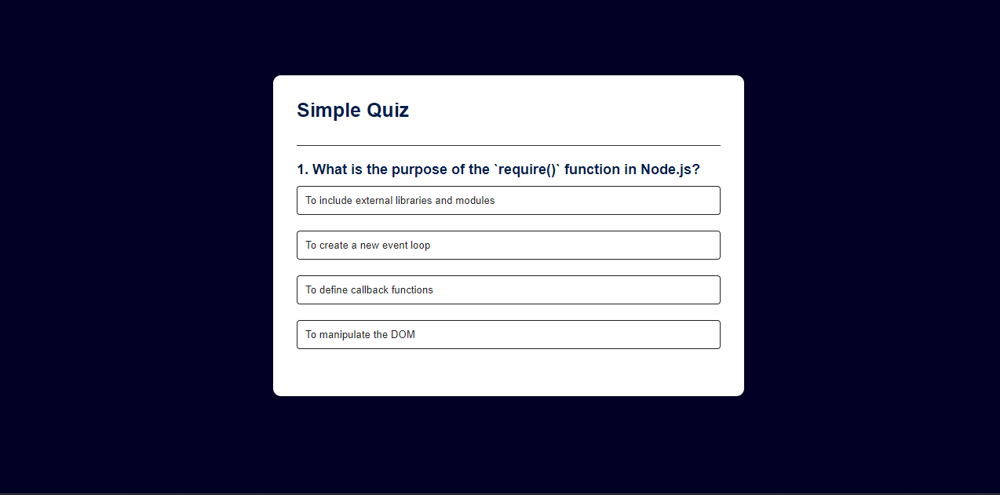

# QUIZ APP

Test your node js knowledge.

## Project

- This is a simple quiz application where users can answer multiple-choice questions (MCQs) fetched from an API. Users can start the server to fetch questions and then go to the frontend folder to initiate the quiz application.

## Getting Started

1. Clone this repository to your local machine.
2. Install dependencies by running `npm install` in the root directory.
3. Start the server by running `npm run dev` in the root directory.
4. Go to the frontend/index.html and open it with live server.

## Technologies Used

List the technologies and tools i've used in your project.

- HTML
- CSS
- JAVASCRIPT
- NODE JS / EXPRESS

## Usage

Once the server is running and the frontend is live, users can start answering the MCQs presented on the webpage.

## API

The quiz questions are fetched from an API using a GET request. Ensure that the API endpoint is correctly configured in the application to retrieve the questions.
